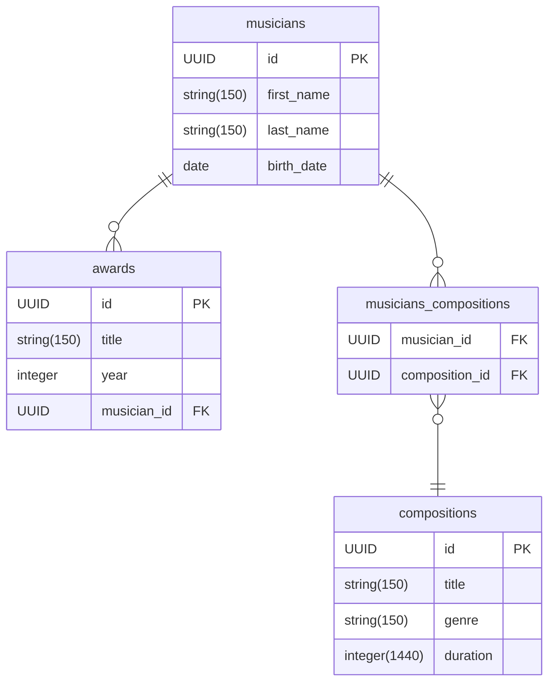

# musicHurricane

> [!CAUTION]
> :construction: Проект ещё в глубокой разработке, возможны недоработки

```mermaid
erDiagram
    awards {
        UUID id PK
        string(150) title
        integer year
        UUID musician_id FK
    }
    compositions {
        UUID id PK
        string(150) title
        string(150) genre
        integer(1440) duration
    }
    musicians {
        UUID id PK
        string(150) first_name
        string(150) last_name
        date birth_date
    }
    musicians_compositions {
        UUID musician_id FK
        UUID composition_id FK
    }

    musicians ||--o{ musicians_compositions : ""
    musicians_compositions }o--|| compositions : ""
    musicians ||--o{ awards : ""
```

> [!WARNING]
> Перед использованием создайте файл `.env` по примеру `example.env`
